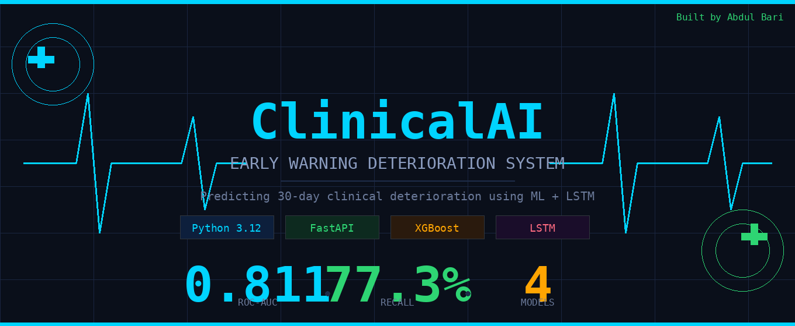
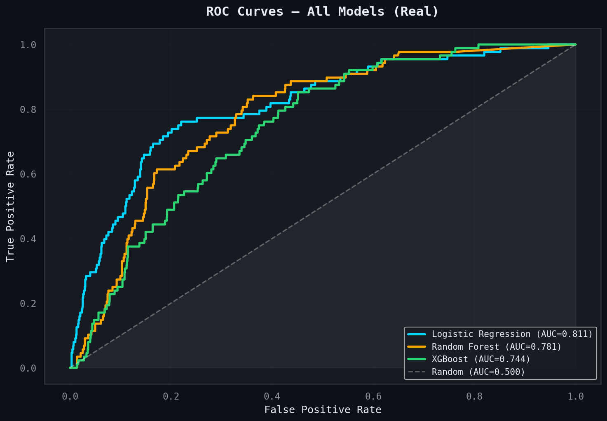
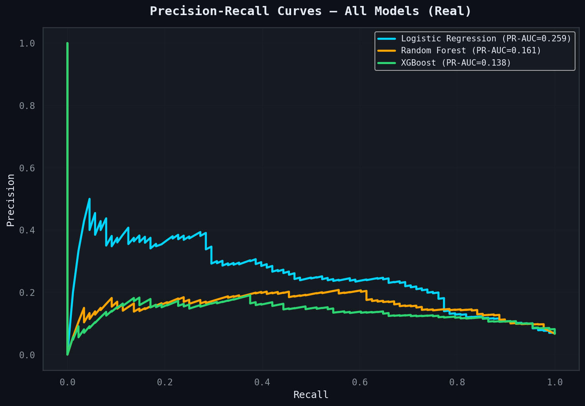
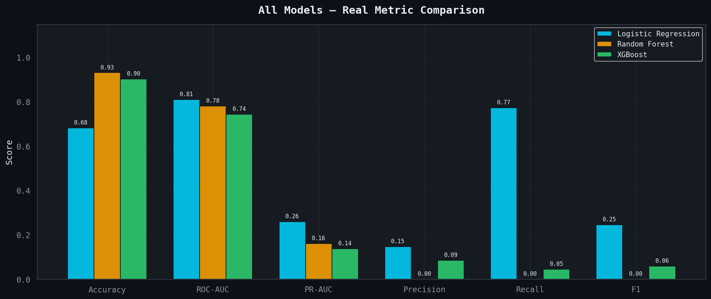
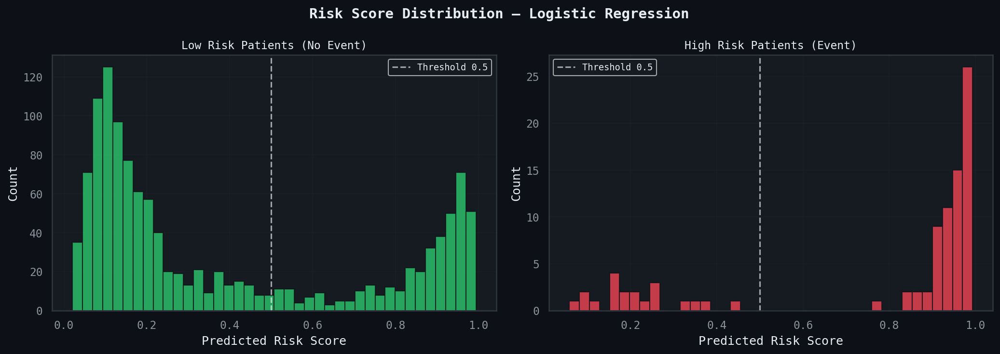
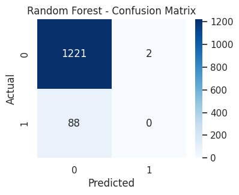
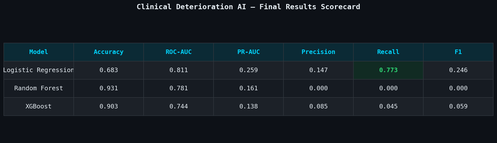
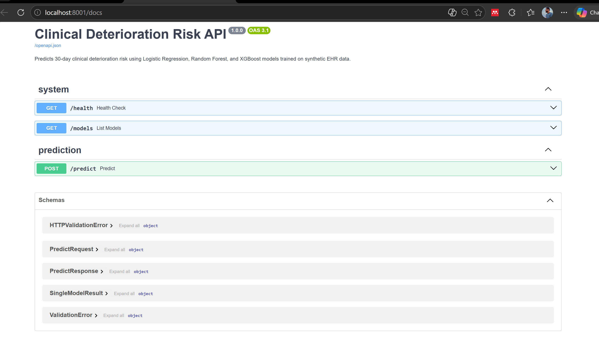
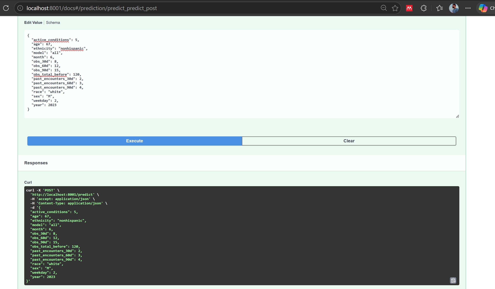

# 🏥 ClinicalAI - Early Warning Deterioration System

<div align="center">




**An end-to-end AI-powered early warning system that predicts 30-day clinical deterioration risk using synthetic EHR data — built to make healthcare AI accessible to everyone.**

[🚀 Live Demo](#) • [📖 Documentation](#) • [🤝 Contributing](#) • [📧 Contact](#)

</div>

## 📌 Overview

ClinicalAI is a free open-source AI health risk platform that predicts whether a patient is at risk of clinical deterioration within the next 30 days. Built using synthetic electronic health records generated by **Synthea**, the system combines classical machine learning and deep learning to deliver real-time risk assessments through a FastAPI backend and a patient-friendly dashboard.

The platform is designed to be accessible to **everyone** from clinicians to the general public, providing early warning signals that help people make informed decisions about their health before conditions worsen.

## 🎯 Problem Statement

Clinical deterioration is often missed until it is too late. Patients who could have been helped with early intervention frequently end up in emergency care because warning signs were not detected in time. This project explores whether routinely collected EHR data can support early warning systems that flag patients at higher risk, giving clinicians and patients the information they need to act early.

## 🧠 Models

| Model | Type | Description |
|---|---|---|
| Logistic Regression | Classical ML | Static feature baseline with class weighting |
| Random Forest | Classical ML | Ensemble tree model with 300 estimators |
| XGBoost | Gradient Boosting | Advanced boosting with imbalance handling |
| LSTM | Deep Learning | Sequence model over 10-step encounter history |

## 📊 Results

### Real Model Performance on Held-Out Test Set

| Model | Accuracy | ROC-AUC | PR-AUC | Precision | Recall | F1 |
|---|---|---|---|---|---|---|
| **Logistic Regression** | 0.683 | **0.811** | **0.259** | 0.147 | **0.773** | **0.246** |
| Random Forest | 0.931 | 0.781 | 0.161 | 0.000 | 0.000 | 0.000 |
| XGBoost | 0.903 | 0.744 | 0.138 | 0.085 | 0.045 | 0.059 |
| LSTM | — | 0.753 | 0.228 | **0.333** | 0.136 | — |

> ⚕️ **Key Insight:** High accuracy does NOT mean a good clinical model. Random Forest achieves 93.1% accuracy but catches zero deteriorating patients. In healthcare AI, **Recall is the most important metric** — missing a sick patient is always worse than a false alarm.

## 📈 Visualizations

### ROC Curves - All Models


### Precision-Recall Curves


### Model Comparison - All Metrics


### Risk Score Distribution


### Model Performance Heatmap


### Final Results Scorecard


## 🏗️ Architecture

```
┌─────────────────────────────────────┐
│           PATIENT / USER            │
│     Enters health information       │
└──────────────┬──────────────────────┘
               │
               ▼
┌─────────────────────────────────────┐
│         REACT DASHBOARD             │
│   Patient friendly interface        │
│   Simple questions in plain English │
│   Traffic light risk display        │
└──────────────┬──────────────────────┘
               │
               ▼
┌─────────────────────────────────────┐
│         FASTAPI BACKEND             │
│   POST /predict endpoint            │
│   Loads trained model files         │
│   Returns risk scores               │
└──────────────┬──────────────────────┘
               │
               ▼
┌─────────────────────────────────────┐
│           AI ENGINE                 │
│   Logistic Regression (.pkl)        │
│   Random Forest (.pkl)              │
│   XGBoost (.pkl)                    │
│   LSTM (Keras)                      │
└─────────────────────────────────────┘
```

## 🗂️ Project Structure

```
Clinical-Deterioration-AI-Agent/
│
├── notebooks/
│   └── Health_care_Warning_AI.ipynb
│
├── src/
│   └── main.py
│
├── models/
│   ├── logistic_regression.pkl
│   ├── random_forest.pkl
│   └── xgboost.pkl
│
├── figures/
│   ├── 15_1_roc_curves_real.png
│   ├── 15_2_pr_curves_real.png
│   ├── 15_3_bar_chart_real.png
│   ├── 15_4_risk_distribution.png
│   ├── 15_5_scorecard.png
│   └── 15_6_model_heatmap.png
│
├── banner.png
└── README.md
```

## ⚙️ Tech Stack

| Layer | Technology |
|---|---|
| Data | Synthea Synthetic EHR |
| ML Models | Scikit-Learn, XGBoost |
| Deep Learning | TensorFlow / Keras LSTM |
| Backend API | FastAPI + Uvicorn |
| Frontend | React + Claude AI |
| Language | Python 3.12 |
| Notebook | Google Colab |

## 🚀 How To Run Locally

### 1. Clone the repository
```bash
git clone https://github.com/AbdulBari33/Clinical-Deterioration-AI-Agent.git
cd Clinical-Deterioration-AI-Agent
```

### 2. Create virtual environment
```bash
py -3.12 -m venv venv312
venv312\Scripts\activate
```

### 3. Install dependencies
```bash
pip install -r requirements.txt
```

### 4. Run the API
```bash
python src/main.py
```

### 5. Open interactive docs
```
http://localhost:8001/docs
```

## 🔌 API Endpoints

| Method | Endpoint | Description |
|---|---|---|
| GET | /health | Health check |
| GET | /models | List loaded models |
| POST | /predict | Get risk prediction |

### Example Request
```json
{
  "age": 67,
  "sex": "M",
  "race": "white",
  "ethnicity": "nonhispanic",
  "active_conditions": 4,
  "past_encounters_30d": 2,
  "past_encounters_60d": 3,
  "past_encounters_90d": 5,
  "obs_total_before": 42,
  "obs_30d": 8,
  "obs_60d": 12,
  "obs_90d": 18,
  "month": 6,
  "weekday": 2,
  "year": 2024
}
```

### Example Response
```json
{
  "results": [
    {"model": "logistic_regression", "risk_probability": 0.27, "risk_label": "low_risk"},
    {"model": "random_forest", "risk_probability": 0.03, "risk_label": "low_risk"},
    {"model": "xgboost", "risk_probability": 0.002, "risk_label": "low_risk"}
  ],
  "feature_count": 19
}
```

## 📸 API Screenshots

### FastAPI Interactive Docs


### Live Prediction Response


## 🌍 Vision & Impact

This project is built with a mission to **democratise healthcare AI globally**. The ultimate goal is to evolve this into a free public health platform where:

- 🧑‍💼 **Patients** get instant AI-powered risk assessments in plain English
- 👨‍⚕️ **Doctors** volunteer their expertise to review flagged cases
- 🌐 **Everyone** gets access to early health warnings regardless of location or income
- 🤖 **AI** acts as the first line of screening making healthcare proactive not reactive

## 🔮 Future Work

- SMOTE oversampling to fix class imbalance for RF and XGBoost
- SHAP explainability for transparent AI predictions
- Threshold optimisation across all models
- Transformer architecture to replace LSTM
- Doctor registration and advisory layer
- Full cloud deployment on Render and Vercel
- Mobile friendly patient interface
- Integration with real EHR datasets MIMIC-III/IV

## 📁 Data

This project uses **synthetic** EHR data generated by [Synthea](https://synthetichealth.github.io/synthea/). No real patient data was used at any point.

## 👨‍💻 Author

**Abdul Bari**
- GitHub: [@AbdulBari33](https://github.com/AbdulBari33)
- Project: Clinical Deterioration AI Agent

## 📄 License

This project is licensed under the MIT License feel free to use, modify and share!

<div align="center">
Built with ❤️ to make healthcare AI accessible to everyone
</div>
